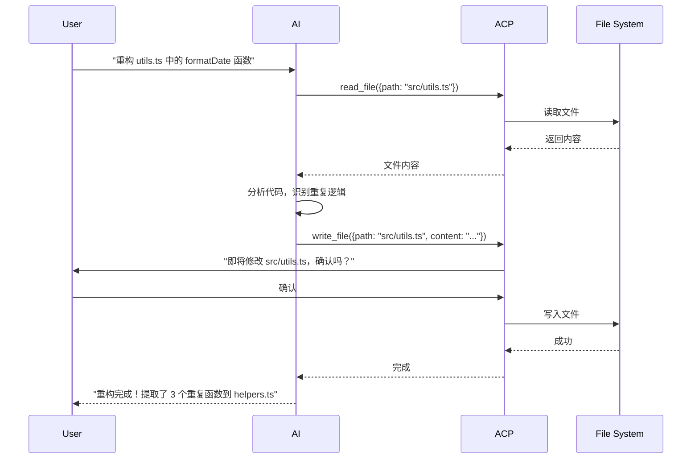

> 让 AI 像人类一样使用计算机的协议标准

## 什么是 ACP？

**ACP (Agent Computer Protocol)** 是一种开放协议标准，定义了 AI Agent 如何与计算机系统进行安全、可控的交互。它解决了 AI 从"对话"到"行动"的关键鸿沟。

### 核心定位

```
┌─────────────────────────────────────────────────────────────┐
│                     传统 AI 交互                              │
│  用户 ←→ AI (纯文本对话)                                      │
│       只能回答问题，无法执行操作                                │
└─────────────────────────────────────────────────────────────┘
                              ↓
┌─────────────────────────────────────────────────────────────┐
│                     ACP 赋能的 AI                            │
│  用户 ←→ AI ←→ ACP ←→ 计算机系统                               │
│       理解意图 → 安全执行 → 返回结果                           │
└─────────────────────────────────────────────────────────────┘
```

## 解决什么场景的问题？

### 1. AI 想要操作计算机，但缺乏标准接口

**场景**：用户说"帮我整理桌面上的截图文件"

**传统方式**：
- AI："抱歉，我无法访问您的文件系统"
- 或需要复杂的自定义集成

**ACP 方式**：
- AI 通过 ACP 调用文件系统工具
- 扫描桌面 → 识别截图 → 创建文件夹 → 移动文件
- 全程自动化，用户只需一句话

### 2. 安全性与可控性的平衡

**场景**：AI 需要执行 shell 命令

**传统方式**：
- 完全开放：危险，AI 可能误删文件
- 完全封闭：AI 无法帮助解决问题

**ACP 方式**：
- 权限分级：read-only → write → execute
- 用户确认：敏感操作需人工授权
- 审计日志：所有操作可追溯

### 3. 跨平台、跨工具的统一协议

**场景**：同一个 AI 需要在不同环境工作

| 环境 | 传统方式 | ACP 方式 |
|------|----------|----------|
| VSCode | 写插件 | 统一协议 |
| Terminal | 写脚本 | 统一协议 |
| Docker | 写 Dockerfile | 统一协议 |
| 浏览器 | 写扩展 | 统一协议 |

**ACP** 提供统一的抽象层，AI 只需学习一套协议。

## ACP 如何解决这些问题？

### 核心架构

```
┌─────────────────────────────────────────────────────────────┐
│                      ACP 协议栈                               │
├─────────────────────────────────────────────────────────────┤
│  Layer 4: Application (应用层)                               │
│           - 文件操作、代码编辑、浏览器控制                      │
├─────────────────────────────────────────────────────────────┤
│  Layer 3: Session (会话层)                                   │
│           - 状态管理、上下文保持、多轮对话                      │
├─────────────────────────────────────────────────────────────┤
│  Layer 2: Security (安全层)                                  │
│           - 权限验证、操作审计、沙箱隔离                        │
├─────────────────────────────────────────────────────────────┤
│  Layer 1: Transport (传输层)                                 │
│           - WebSocket / HTTP / STDIO                         │
└─────────────────────────────────────────────────────────────┘
```

### 关键机制

#### 1. Tool Schema 定义

每个工具都有标准化的 JSON Schema 定义：

```typescript
// 文件读取工具示例
{
  name: "read_file",
  description: "读取文件内容",
  parameters: {
    type: "object",
    properties: {
      path: {
        type: "string",
        description: "文件路径"
      },
      limit: {
        type: "number",
        description: "读取行数限制",
        default: 100
      }
    },
    required: ["path"]
  },
  // 安全元数据
  security: {
    level: "read-only",
    allowedPaths: ["/home/user/workspace/*"],
    blockedPaths: ["/etc/*", "~/.ssh/*"]
  }
}
```

#### 2. 请求-响应模型

```typescript
// AI 发送请求
interface ACPRequest {
  id: string;
  tool: string;
  params: Record<string, unknown>;
  context?: {
    sessionId: string;
    permissions: string[];
  };
}

// 系统返回结果
interface ACPResponse {
  id: string;
  status: "success" | "error" | "pending";
  result?: unknown;
  error?: {
    code: string;
    message: string;
    details?: unknown;
  };
  // 审计信息
  audit: {
    timestamp: string;
    duration: number;
    userApproved?: boolean;
  };
}
```

#### 3. 权限与安全模型

```
┌─────────────────────────────────────────────────────────────┐
│                    权限层级                                   │
├─────────────────────────────────────────────────────────────┤
│  Level 1: Observer (观察员)                                  │
│           - 只能读取文件、查看状态                              │
│           - 无需用户确认                                       │
├─────────────────────────────────────────────────────────────┤
│  Level 2: Assistant (助手)                                   │
│           - 可以编辑文件、运行只读命令                          │
│           - 敏感操作需用户确认                                  │
├─────────────────────────────────────────────────────────────┤
│  Level 3: Operator (操作员)                                  │
│           - 可以执行写操作、运行脚本                            │
│           - 所有执行操作需用户确认                              │
├─────────────────────────────────────────────────────────────┤
│  Level 4: Administrator (管理员)                              │
│           - 完整系统访问权限                                   │
│           - 需要显式授权 + 二次确认                             │
└─────────────────────────────────────────────────────────────┘
```

## Showcase：ACP 实战场景

### 场景 1：智能代码助手

**用户需求**："帮我重构这个函数，提取重复的代码"



### 场景 2：自动化运维

**用户需求**："检查服务器状态，如果有问题就重启服务"

```typescript
// AI 通过 ACP 执行
const result = await acp.execute({
  tool: "ssh_exec",
  params: {
    host: "prod-server-01",
    command: "systemctl status nginx",
    timeout: 30000
  }
});

if (result.status === "failed") {
  // AI 分析后决定重启
  await acp.execute({
    tool: "ssh_exec",
    params: {
      host: "prod-server-01",
      command: "sudo systemctl restart nginx",
      requireApproval: true // 需要用户确认
    }
  });
}
```

### 场景 3：浏览器自动化

**用户需求**："帮我从 Twitter 导出最近一周的点赞记录"

```typescript
// AI 通过 ACP 控制浏览器
await acp.browser.open("https://twitter.com");
await acp.browser.click('[data-testid="AppTabBar_Profile_Link"]');
await acp.browser.click('[data-testid="ProfileTabBar_Likes"]');

// 滚动并收集数据
const likes = [];
for (let i = 0; i < 10; i++) {
  const tweets = await acp.browser.extract({
    selector: '[data-testid="tweet"]',
    fields: {
      text: '.tweet-text',
      author: '.username',
      date: 'time'
    }
  });
  likes.push(...tweets);
  await acp.browser.scroll({ direction: "down", amount: 800 });
}

// 导出为 CSV
await acp.write_file({
  path: "~/twitter_likes.csv",
  content: convertToCSV(likes)
});
```

## ACP 与现有方案对比

| 特性 | MCP (Anthropic) | ACP (OpenClaw) | Function Calling |
|------|-----------------|----------------|------------------|
| **定位** | 上下文协议 | 计算机交互协议 | LLM 功能调用 |
| **范围** | 对话上下文管理 | 系统资源访问 | 特定函数调用 |
| **安全** | 基础权限 | 分层权限 + 审计 | 依赖实现 |
| **跨平台** | 需适配 | 原生支持 | 需适配 |
| **生态** | Anthropic 主推 | 开放标准 | 各厂商独立 |

## 未来展望

### 标准化进程

ACP 正在向开放标准演进：
- **Tool Registry**：统一的工具注册中心
- **Security Spec**：安全审计标准
- **Multi-Agent**：多代理协作协议

### 生态建设

```
┌─────────────────────────────────────────────────────────────┐
│                    ACP 生态愿景                              │
├─────────────────────────────────────────────────────────────┤
│  🛠️  Tool Registry (工具市场)                               │
│     数千个标准化工具，即插即用                                 │
├─────────────────────────────────────────────────────────────┤
│  🔒  Security Framework (安全框架)                           │
│     企业级权限管理、审计合规                                   │
├─────────────────────────────────────────────────────────────┤
│  🤖  Agent Marketplace (代理市场)                            │
│     专业领域 AI 代理，开箱即用                                 │
├─────────────────────────────────────────────────────────────┤
│  🌐  Universal Connector (通用连接器)                        │
│     连接一切：数据库、API、IoT 设备、云服务                    │
└─────────────────────────────────────────────────────────────┘
```

## 结语

ACP 不仅是一个协议，更是 AI 从"对话"走向"行动"的关键基础设施。它让 AI 能够像人类一样使用计算机，同时保持安全、可控、可审计。

随着 AI Agent 的普及，ACP 将成为连接 AI 与数字世界的标准接口，让"AI 助手"真正成为"AI 代理"。

---

**相关资源**
- OpenClaw 文档: https://docs.openclaw.ai
- ACP 协议规范: https://github.com/openclaw/acp
- 示例代码: https://github.com/openclaw/acp-examples